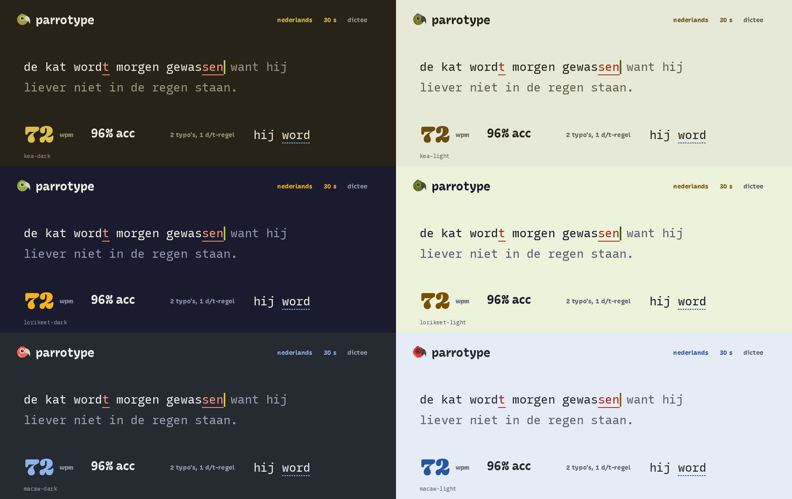
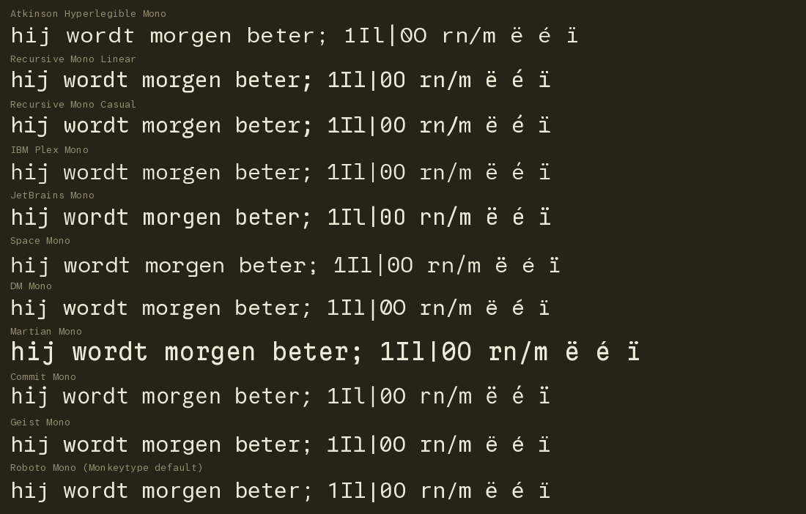
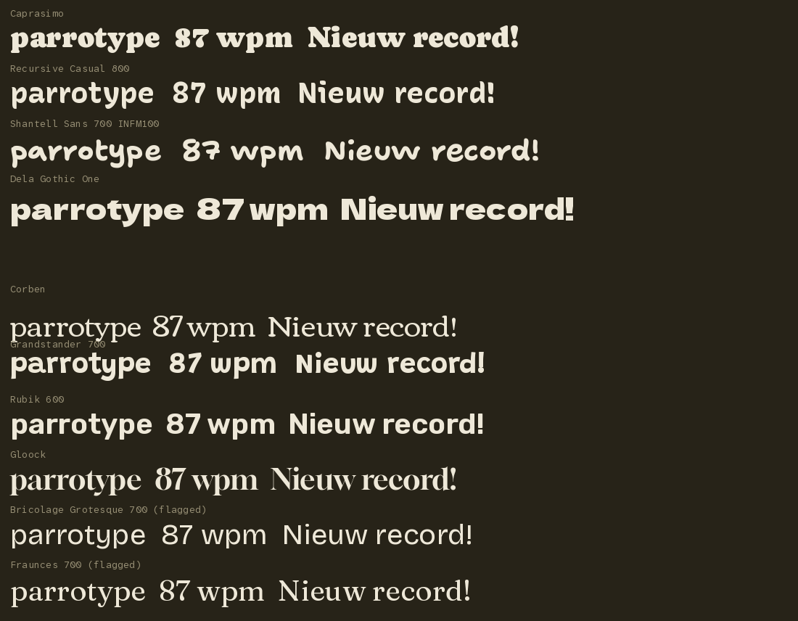
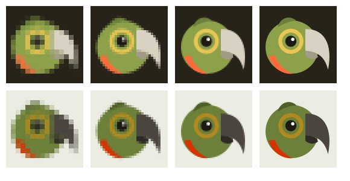

# Designing Parrotype so it does not look AI-generated

> **Audience:** the engineers and designers building Parrotype (repo `parrotype`). It is a static Vite + TypeScript typing trainer with a parrot mascot, deployed to Vercel, built for one user who makes many typos in Dutch (most important), English and later Arabic.
>
> **Scope:** (1) what makes a 2025-2026 website read as "AI-generated" or generic, backed by measured data where it exists; (2) what makes a design feel hand-made, specific and playful; (3) a concrete design direction for Parrotype: palettes from real parrot species with checked WCAG contrast, font pairings, a logo that works at 16 px, mascot micro-animations, motion tokens, microcopy, and a DO / DON'T list.
>
> **How the research was done:** web search plus primary sources. Many design blogs, Hacker News, Wikipedia, W3C, Duolingo and Chrome developer pages were **blocked by the egress proxy**. Findings from those sources rest on search-engine summaries and are marked **(secondary)**. Everything on GitHub or npm I **read first-hand**:
> - Adrian Krebs' slop detector (`AdrianKrebs/ai-design-checker`), including its pattern code and thresholds
> - Anthropic's `frontend-design` skill
> - the `pixelslop` slop catalog (npm)
> - Emil Kowalski's animation standards
> - the Mailchimp content style guide
> - the Monkeytype source (themes, default config, focus mode, fonts)
> - three bird-palette packages (Manu, birdcolors, ochRe)
> - Google Fonts `METADATA.pb` files
> - the Fontsource npm packages
>
> **What I computed myself** (scripts in the session scratchpad):
> - WCAG contrast ratios for every token
> - colour-vision-deficiency (CVD) simulation using the Machado 2009 matrices, with distance measured in OKLab
> - font file sizes after pinning variable axes with fontTools
> - Rive runtime size
> - a 16/32/64/128 px render test of the logo
>
> Images are in `docs/research/assets/design-not-ai/`.
>
> **Evidence labels:** **[Measured]** = a quantitative study or my own computation; **[Primary]** = a first-hand source (code, official guide); **[Secondary]** = search summaries or blogs; **[Opinion]** = design judgment, clearly marked.
>
> Note on style: this document avoids em dashes and the stock phrases it warns against. That is deliberate.

---

## 0. Summary: 16 rules for the build

1. **Start from the subject, not from a template.** Every visual choice should trace back to parrots, typing or Dutch spelling. Anthropic's own design guidance calls this "ground your designs in the subject matter" [Primary].
2. **No indigo/violet accents** (hue 250 to 300°, which is the range Krebs' detector flags as "VibeCode purple"), no purple-to-blue gradients, no gradient text [Measured + Primary].
3. **Do not use the "templated" display fonts.** Krebs' detector currently flags Space Grotesk, Instrument Serif, Fraunces, Bricolage Grotesque, Sora, Young Serif, Bodoni and Syne, and his README also lists Geist. Inter, DM Sans, Plus Jakarta Sans and Manrope count as "generic sans". Several fonts suggested in the original brief are on these lists (§2.2) [Primary].
4. **Be careful with the dark default.** "Near-black background plus one acid accent" and "dark background with muted grey text" are both recognised AI clusters. The fix is a *tinted* dark background taken from a real bird (kea olive-black `#272318`), body text at 7:1 or higher, and three or more accent roles instead of one neon (§4.2) [Primary].
5. **Use one memorable thing, not ten.** For Parrotype that is the kea mascot and its hidden orange underwing. Everything else stays quiet [Primary: Anthropic skill, "spend your boldness in one place"].
6. **Make the typing text the hero.** Follow Monkeytype: chrome fades while typing, the mouse cursor hides, the caret stops blinking (verified in `frontend/src/ts/test/focus.ts`) [Primary].
7. **Never animate anything that fires on every keystroke** (except caret movement). Mascot reactions happen *between* runs, not during them [Primary: Emil Kowalski's frequency table].
8. **Never encode correct vs wrong with red/green alone.** Wrong characters get colour plus an underline. Spelling gets a wavy underline, grammar a dashed one. Correct text stays in the neutral text colour, not green. Checked under protan, deutan and tritan simulation [Measured].
9. **Every text token is at least 4.5:1** against the background *and* the surface colour, in all six themes. Body text is at least 12:1 [Measured, §4.2].
10. **Self-host fonts and pin variable axes.** Recursive Mono pinned to one style is 25.9 KB (woff2, Latin) instead of 305 KB for the full variable font. Turn off ligatures and contextual alternates in the typing area [Measured + Primary].
11. **Draw the mascot as inline SVG with CSS/WAAPI, not Rive or Lottie.** Rive's lightest web runtime is about 475 KB gzipped (370 KB wasm + 108 KB JS); an SVG mascot is about 3 KB [Measured].
12. **The mascot has rules.** He never guilt-trips, never cries, never lectures. Following the Mailchimp rule for Freddie ("he does not talk"), Kees only *repeats correct words* ("wordt. wordt. wordt."), which is what parrots do and matches the pedagogy research [Primary + Opinion].
13. **Write copy with specific facts, dry humour and no stock phrases.** Never use "Unlock", "Supercharge", "Seamless", "Get started" or a sparkle emoji. No em dashes in UI copy. No exclamation marks in errors [Primary: Mailchimp].
14. **Replace confetti with a feather burst**, used only for personal bests, and draw hand-made annotations (rough-notation, 4 KB) on the results page only [Measured sizes].
15. **Use real structure, not decoration.** No ALL-CAPS eyebrow labels, no "01 / 02 / 03" unless the content is a sequence, no middle-dot meta strings, no "→" appended to buttons, no identical card grids [Primary].
16. **Audit automatically.** Run Krebs' detector against each Vercel preview (target 0 to 1 patterns) and keep a unit test that asserts every theme's contrast pairs (§4.11).

---

## 1. Why AI-built sites converge on one look

- **Models return the statistical median.** A large language model asked for "a landing page" without constraints produces the average of its training data. "Vibe coded websites look alike because nobody decided how yours should look" [Secondary: codemyspec, prg.sh]. A uxdesign.cc essay puts it as "AI design isn't ugly, it's *fluent*, and that's the problem" [Secondary].
- **The purple has a known origin.** In August 2025 Tailwind co-creator Adam Wathan posted an apology (reported at over 1M views) for making every button in Tailwind UI `bg-indigo-500` five years earlier. The indigo default spread through tutorials and starter kits into training data, so "modern web design = purple buttons" became an implicit rule [Secondary: prg.sh, aibase, chaiovercode].
- **shadcn/ui plus Lucide plus Tailwind is the default stack** of v0, Lovable and Bolt. Every prototype "looks like a cousin of the last one", and there is a feedback loop: more shadcn output on GitHub leads to more shadcn in training data [Secondary: bswen, buildmvpfast].
- **The "Linear look"** (near-black UI, a single purple accent, blurred gradient artwork, glows, Cmd+K) became the house style of SaaS. Designer Daryl Ginn called it "the Linear effect". A December 2025 HN thread asked why every B2B SaaS must look like Linear or Stripe. Linear's own lighting effects are subtle; its imitators are not [Secondary: Rectangle, LogRocket, buildmvpfast].
- **Users now notice it.** pixelslop's catalog: "An AI-generated look now signals 'nobody designed this' the same way clip art signaled 'nobody hired a designer' in 2005" [Primary: pixelslop catalog].

### 1.1 Measured: how common are the tells? [Measured, partly Secondary]

Adrian Krebs scored about **1,590 Show HN landing pages** with a headless-browser detector of deterministic DOM patterns. The blog post was blocked; these numbers come from search summaries of the post and its HN thread (333 points, 235 comments):

| Result | Share |
|---|---|
| Heavy (4+ patterns) | **22%** |
| Mild (2 to 3 patterns) | **32%** |
| Clean (0 to 1) | **46%** |
| Gradient backgrounds or gradient hero text | 28.0% |
| Untouched shadcn/ui signature (Radix + shadcn CSS vars + Lucide) | 23.5% |
| Dark background + grey text + uppercase section labels | 20.3% |
| Templated feature grid (3 or 6 identical icon-topped cards) | 20.1% |

I read the detector's source myself. The **14 patterns** in the repo README are:
1. templated display fonts
2. hero font mix (one word in a second font, italic or colour)
3. "Vibe purple" CTAs
4. gradients
5. accent stripe on a card edge
6. glassmorphism
7. coloured glow
8. emoji nav
9. centered hero + Inter
10. "perma dark" (dark background with muted grey body text)
11. numbered 1·2·3 steps
12. stat banner ("10K+ users · 99.9% uptime")
13. headline pill badge above the H1
14. FAQ accordion

The README says manual checks on about 150 labelled sites suggest 5 to 10% false positives.

Exact thresholds worth knowing (from `src/`):
- **Purple:** `hue 250..300°, saturation > 25%, lightness 15..85%` (`src/lib/color.js`). Parrotype palettes are checked against this (§4.2).
- **Templated heading fonts:** `Space Grotesk, Instrument Serif, Fraunces, Bricolage Grotesque, Sora, Young Serif, Bodoni, Syne` (`src/patterns/slop-fonts.js`). A font is flagged when it is the heading font or 25% or more of the text. The README table also names Geist.
- **Generic sans for the "centered hero" pattern:** `Inter, system-ui, Helvetica, Arial, DM Sans, Plus Jakarta Sans, Manrope, SF Pro Display` (`src/patterns/centered-hero.js`).
- **Perma dark:** the body background is dark and 12% or more of body text is below **7:1** contrast (`src/patterns/perma-dark-mode.js`). The lesson for a dark theme: keep body/UI text at 7:1 or higher.

---

## 2. Catalogue of tell-tale signs, and the Parrotype rule for each

Sources: Krebs detector [Primary/Measured], Anthropic `frontend-design` skill [Primary], pixelslop catalog (26 visual patterns) [Primary], plus blogs and threads [Secondary].

### 2.1 Colour

| Tell | Why it reads as AI | Parrotype rule |
|---|---|---|
| Indigo/violet CTA, purple-to-blue hero gradient | Tailwind `indigo-500` legacy; most-flagged colour in Krebs' data | No accent hue in 250 to 300°. Blues stay at or below 220° |
| Gradient text (`background-clip: text`) | pixelslop severity 3 ("text used as a canvas for decoration") | Never. Big numbers are a solid colour |
| Gradient washes / mesh blobs behind the hero | 28% of Show HN sites | No decorative gradients. Grain texture only (§4.8) |
| Near-black bg (`#0B0B0B`, `#111`) + one acid-green or vermilion accent | Anthropic cluster 2; pixelslop "neon accents on dark" | Dark bg is a *tinted* bird colour, with three accent roles in fixed jobs |
| Dark bg + muted grey body text | Krebs "perma dark" (below 7:1) | UI body text 12:1 or higher. Only the *upcoming typing text* uses the muted `sub` colour, still at 4.5:1 or higher |
| Cyan on dark, coloured glows (`box-shadow` halos) | pixelslop severity 3 | No coloured shadows at all |
| Warm cream bg `#F4F1EA` + high-contrast serif + terracotta `#D97757` | Anthropic cluster 1 (that terracotta is Anthropic's own accent) | Light themes are tinted lichen-green or face-skin blue. No serif display, no terracotta as the brand accent |
| Pure `#000` / `#fff` backgrounds | pixelslop pattern 16 | Never pure. All neutrals tinted toward the theme hue |
| Grey `#666/#999` text on coloured backgrounds | pixelslop pattern 24 | Muted text is mixed from the theme hue, never a generic grey |

### 2.2 Typography

| Tell | Parrotype rule |
|---|---|
| Inter / Roboto / system-ui for everything | Use a deliberate family (§4.3). Inter only as an emergency fallback in the font stack |
| Geist / Geist Mono | Avoid. It is Vercel's typeface and strongly tied to the v0 / Vercel look (listed in Krebs' README). Parrotype is *deployed* on Vercel; it should not *look* like it |
| Trendy display fonts used as the page default: Space Grotesk, Instrument Serif, Fraunces, Bricolage Grotesque, Sora, Young Serif, Syne | The brief suggested Bricolage Grotesque, Fraunces, Young Serif and Instrument Serif. **All four are now flagged as templated defaults.** Do not use them as heading fonts |
| One headline word in italic or a different colour ("hero font mix") | Never accent a single word in a headline |
| Tracked ALL-CAPS eyebrow label above every heading | No eyebrows. Labels use sentence case |
| Monospace for small "tech-vibe" data labels | Monospace appears in the **typing text only** (where it is functional), never on UI labels |
| Middle-dot meta strings "A · B · C"; "WORD + spaced em dash + fragment" labels; "→" appended to links | Not used. Settings are real toggles; links say what they do |

### 2.3 Layout and components

| Tell | Parrotype rule |
|---|---|
| Centered hero, big headline, subline, two buttons ("Get started", "Learn more") | No marketing hero. The first screen *is* the typing test (as on Monkeytype) |
| Three or six identical icon-topped feature cards; bento grid | No feature grid at all. One page, one job |
| Everything in rounded-2xl cards with `rgba(0,0,0,.1)` shadows; cards in cards | No shadows. The typing area has no box. Results use typographic hierarchy and one tonal surface, not a card per stat |
| One border-radius on everything | Radius policy: typing area 0, controls 6 px, toggle knob fully round. Nothing else is rounded |
| Pill badge above the H1 ("New ✨") | No badges |
| Stat banner, 1·2·3 steps, FAQ accordion, placeholder testimonials | None of these. A single-user tool has no social proof to fake |
| Glassmorphism (`backdrop-filter`) panels | Not used (it also hurts text contrast) |
| Emoji as icons; generic Lucide grids; sparkle ✨ for "smart" features | At most about 6 icons, drawn for Parrotype (§4.4). The grammar checker is *not* "AI ✨"; it is a parrot in reading glasses |
| Accent stripe on the left/top edge of cards | Not used |
| Everything centered and symmetric | The typing column is centered for focus, but text inside is left-aligned and the results page is deliberately asymmetric (§4.4) |
| Every button primary | One primary action per screen at most |
| Same 24/32 px spacing everywhere | Use a spacing scale with real rhythm (§4.4) |

### 2.4 Motion

| Tell | Parrotype rule |
|---|---|
| Fade-and-slide-up on every section; hover transitions on every card | Anthropic: "read as AI-generated". One orchestrated moment per screen at most |
| `hover: scale(1.05)` on everything | No hover scale. Press feedback is `scale(0.97)` only, gated by `@media (hover:hover) and (pointer:fine)` for hover effects |
| Bouncy elastic easing on UI chrome | pixelslop flags bounce/elastic curves. Springs are reserved for the mascot and the PB moment (§4.7) |
| Shimmering "thinking" gradients, token-streaming text | Not used. Grammar results appear at once, without decoration |

### 2.5 Copy

| Tell | Parrotype rule |
|---|---|
| "Unlock your potential", "Supercharge", "Elevate", "Seamless", "Effortless", "Empower", "Game-changer", "Revolutionize" | Banned list (§4.9) |
| "Get started", "Learn more", "Ready to …?", "Say goodbye to …", "Whether you're X or Y" | CTAs say exactly what happens: "Start typing", "Again", "Practise these 6 words" |
| Em dashes everywhere; rule-of-three lists; "stands as a testament" | Em dashes became a public AI tell from late 2024 (Rolling Stone, TechRadar). Wikipedia's "Signs of AI writing" field guide stresses its list is descriptive, not prescriptive [Secondary]. Parrotype UI copy uses no em dashes |
| Heading "Our Features" plus subheading "Explore the features we offer" | No redundant restating (pixelslop pattern 19) |
| Fake testimonials, invented stats | Never. Show the user's own real numbers |

### 2.6 Imagery

| Tell | Parrotype rule |
|---|---|
| Generic 3D blobs, stock isometric people, AI-rendered hero art | One custom SVG mascot drawn with the palette's own pigments; hand-drawn annotation strokes on results |
| Decorative sparklines that carry no data | Charts only show the user's real data (WPM over time, error positions) |

---

## 3. What makes design feel crafted

### 3.1 Principles (with sources)

1. **Specificity from the subject.** "The subject's industry, subject matter, materials, and vernacular are where distinctive visual choices come from" [Primary: Anthropic]. For Parrotype: parrot plumage, the act of copying ("parroting"), Dutch d/t spelling, the caret.
2. **Restraint: spend your boldness once.** "Let one element be the memorable thing, keep everything around it quiet and disciplined… take a look in the mirror and remove one accessory" [Primary: Anthropic]. pixelslop: "Defaults are slop. Choices are design" [Primary].
3. **Visual structure is information.** Borders, numbering and labels should encode something about the content. Use "01/02/03" only for real sequences [Primary: Anthropic].
4. **Interaction feel beats appearance.** The invisible details are what matter: exact easing, a 50 ms delay that prevents a flash, robustness of text input. "If your UI only works 80% of the time, the perception of quality breaks" [Secondary: summaries of Rauno Freiberg's "Invisible Details of Interaction Design"]. For a typing app, keystroke latency and caret accuracy *are* the craft.
5. **Motion that answers the user.** Emil Kowalski's frequency rule: actions done 100+ times a day get **no animation**; occasional actions get standard animation; rare moments (celebrations, onboarding) "can add delight" [Primary: emilkowalski/skill STANDARDS.md].
6. **Humour with a straight face.** Mailchimp: "We prefer the subtle over the noisy, the wry over the farcical… We prefer winking to shouting… forced humor can be worse than none at all. If you're unsure, keep a straight face." Also: "Never use exclamation points in failure messages or alerts." [Primary: Mailchimp content style guide].
7. **Human texture is in fashion again.** Trend reports for 2026 describe an "anti-AI crafting" counter-movement (grain, hand lettering, collage). Canva's 2026 report is cited as showing lo-fi aesthetic searches up 527% [Secondary: brandcloud summary]. **Use it as seasoning, not as a costume.** A typing app must stay crisp where the text is.

### 3.2 Mascots that work, and why

| Mascot | What makes it work | Lesson for Parrotype |
|---|---|---|
| **Duolingo's Duo** | Redesigned in 2019 with Johnson Banks. "Basically a chicken nugget with a face": a few simple shapes make him easy to pose, and big eyes make expressions clear. The earlier version's eyes "glared creepily". Geometric shapes and flat perspective make animation and compositing easy. Animation is used "during the most rewarding moments". In-lesson characters run on Rive state machines with viseme lip-sync [Secondary: Creative Review, Design Week, Duolingo blog via search] | Build Kees from about 6 primitives; big readable eye; flat perspective; animate rewarding moments only |
| **Duo's guilt marketing** | "Don't let Duo down", the crying owl, the "evil owl" meme. Duolingo's CEO called the notifications "a reasonable balance between nice and mean" [Secondary: Daily Dot] | It works for a mass-market streak app. For one person who already makes many typos, it would punish. **Kees never guilt-trips** |
| **Mailchimp's Freddie** | "He smiles, winks, and sometimes high-fives, but he does not talk. Don't write in his voice." [Primary: Mailchimp guide] | The interface speaks; the mascot reacts. Kees's one exception: he *repeats correct words* (it is literally what parrots do) |
| **GitHub's Octocat** | Bought as stock clip art from Simon Oxley, then adapted by Cameron McEfee into hundreds of Octodex variants. A strong silhouette that tolerates costumes became participatory culture [Secondary] | A simple silhouette lets Kees wear "costumes" per theme (kea, lorikeet, macaw skins) and per mode (monocle vs reading glasses) |

Parrot-specific authenticity [Secondary: Chewy bird body language; kea facts]:
- Real parrots **head-bob** when happy to see you, **fluff feathers** in greeting, **grind their beaks** when calm and sleepy (similar to purring), and **"pin" their eyes** (rapid pupil size changes) when excited.
- Kea are often called the most intelligent bird, nicknamed the "clown of the mountains", and are famous for dismantling car wiper blades.
- Alex the African grey (Irene Pepperberg's 30-year study) used over 100 words meaningfully, "not merely parroting". His last words were "You be good. I love you. See you tomorrow." [Secondary: Nature news 2007]

Animating real behaviours instead of generic cartoon emotes is a cheap source of authenticity.

---

## 4. The Parrotype design direction

### 4.1 Concept: "Kees the kea" [Opinion, grounded in the sources above]

- **The species is the kea** (*Nestor notabilis*): olive-green plumage with dark feather edges, a long dark-grey hooked beak, and a **brilliant orange-red underwing that only shows in flight**. Kea are clever and cheeky ("wise but playful", exactly the brief).
- **The name is Kees.** It is a common Dutch first name and sounds almost like "kea". It is a small in-joke for a Dutch user, not a stock mascot name.
- **The wise twist:** Kees wears a **monocle**. A single ring around the eye still reads at 16 px, where two-lens reading glasses turn to mush. In grammar/dictation mode he swaps the monocle for **reading glasses** (large sizes only).
- **The colour story:** the everyday UI is kea olive and feather-pale. The **hidden underwing orange is revealed for personal bests** (the feather burst, the wing-lift). Mistakes use a softer coral from the same family, always with an underline.
- **The parrot's job:** copy-typing is literally parroting. After a run, Kees *repeats* the correct form of a misspelled word three times ("wordt. wordt. wordt."). The pedagogy research (`docs/research/typing-pedagogy.md`, rule 10) says the correct form should be the most prominent thing on screen. Kees does exactly that, with personality.

### 4.2 Palettes from real parrot species

**Provenance.** Base pigments come from photo-derived palette packages that list their colours in source code:
- **Kea**: `Manu` (R package, colours extracted from photos of New Zealand birds): `#6C803A #7B5C34 #AB7C47 #CCAE42 #D73202 #272318 #D3CDBF`.
- **Rainbow lorikeet**: `ochRe` (sourced from a reptile-park photo): `#486030 #c03018 #f0a800 #484878 #a8c018 #609048`.
- **Scarlet macaw**: `birdcolors` ("made with 100% REAL birds", Tonelli & Youngflesh): `#FF3D3F #3870C5 #E0AD04 #262A31 #B8CBDE #33794A #273C93`.
- Manu also has Kākā, Kākāpō and Kākāriki palettes; `feathers` has eastern rosella, princess parrot and galah.

For **budgerigar, African grey and hyacinth macaw** I found **no photo-derived source**. Any hex values for them would be my invention, so they are left out (or flagged if added later).

Hex values were then **tuned for contrast**, keeping the hue family:
- the dark backgrounds use the source's own darkest pigment (kea `#272318`, macaw `#262A31`) or a darkened one (lorikeet head blue darkened to `#1A1B2E`)
- the accents were lightened for dark mode and darkened for light mode until every text token passed AA.

**Token model.** This extends Monkeytype's 10-key theme model (`bg, main, caret, sub, subAlt, text, error, errorExtra, colorfulError, colorfulErrorExtra` in `frontend/src/ts/constants/themes.ts`) with roles for grammar and surfaces:

| Token | Role |
|---|---|
| `bg` | page background |
| `surface` | the one tonal panel (results details, settings sheet) |
| `border` | hairlines (decorative, no contrast requirement) |
| `text` | typed-correct text, UI body text |
| `sub` | **upcoming** (untyped) typing text, secondary labels |
| `caret` | caret, the theme's signature colour |
| `main` | active controls, focus ring, the big result number, links |
| `error` | wrong characters (always with an underline) |
| `errorExtra` | extra typed characters (always with a strikethrough) |
| `grammar` | grammar underline in free-writing (dashed) |
| `ok` | positive stat deltas (always with a "+" or a label, never alone) |

All ratios below were **computed** (WCAG 2.x relative luminance). AA text needs **4.5:1** and non-text UI needs **3:1**.

#### Palette A: **Kea** (recommended default)

Olive-black night, feather-pale text, lime-olive caret, ochre highlights, underwing coral for mistakes.

| token | kea-dark (default) | vs bg | vs surface | kea-light | vs bg | vs surface |
|---|---|---|---|---|---|---|
| bg | `#272318` | | | `#E6E9D8` | | |
| surface | `#312C1F` | | | `#DADEC9` | | |
| border | `#4A4433` | 1.6 | | `#B9BEA4` | 1.6 | |
| text | `#EEE8D8` | **12.8** | 11.4 | `#272318` | **12.7** | 11.4 |
| sub | `#9D957B` | 5.2 | 4.6 | `#625E4C` | 5.3 | 4.7 |
| caret | `#B9CC5E` | 8.9 | 7.9 | `#4E6018` | 5.7 | 5.1 |
| main | `#DDBE4F` | 8.6 | 7.6 | `#6A4E0F` | 6.3 | 5.6 |
| error | `#FF9A6E` | 7.5 | 6.7 | `#A32900` | 5.9 | 5.3 |
| errorExtra | `#E5764F` | 5.3 | 4.7 | `#741F00` | 8.8 | 7.9 |
| grammar | `#8EC3EA` | 8.3 | 7.4 | `#1D5486` | 6.4 | 5.7 |
| ok | `#A3B860` | 7.2 | 6.3 | `#45561C` | 6.5 | 5.9 |

Mascot pigments (decorative, meaningful graphics 3:1 or higher where it matters):
- head olive `#6C803A` (dark theme `#8CA14A`)
- feather edge `#4E5F27`
- beak `#4A463F` on light / `#D9D2C3` on dark
- monocle gold `#B08A1E` / `#E7C653`
- underwing `#D73202` / `#FF6A3D`

#### Palette B: **Rainbow lorikeet** (most playful)

Head-blue night, mango highlights, lime caret.

| token | lorikeet-dark | vs bg | vs surface | lorikeet-light | vs bg | vs surface |
|---|---|---|---|---|---|---|
| bg | `#1A1B2E` | | | `#EDF2DB` | | |
| surface | `#232539` | | | `#E1E8CA` | | |
| border | `#383B5A` | 1.6 | | `#C2CBA6` | 1.5 | |
| text | `#EEF0E4` | **14.7** | 13.1 | `#1A1B2E` | **14.8** | 13.4 |
| sub | `#9396B2` | 5.8 | 5.2 | `#585B74` | 5.8 | 5.2 |
| caret | `#B6CF2A` | 9.6 | 8.6 | `#386116` | 6.3 | 5.7 |
| main | `#F5B21B` | 9.1 | 8.1 | `#7A5000` | 6.2 | 5.6 |
| error | `#FF9677` | 8.0 | 7.1 | `#A3210F` | 6.6 | 6.0 |
| errorExtra | `#EC765C` | 5.9 | 5.2 | `#741706` | 9.8 | 8.9 |
| grammar | `#8FC6F2` | 9.3 | 8.3 | `#1D4C87` | 7.5 | 6.8 |
| ok | `#8CC063` | 7.9 | 7.0 | `#386116` | 6.3 | 5.7 |

The lorikeet background is hue 237° (blue, not violet), safely under the 250° "vibe purple" line. Keep it that way if you tweak it.

#### Palette C: **Scarlet macaw** (bold, primary colours)

Slate night, sunflower caret, sky-blue links, scarlet only for the mascot body and for errors.

| token | macaw-dark | vs bg | vs surface | macaw-light | vs bg | vs surface |
|---|---|---|---|---|---|---|
| bg | `#262A31` | | | `#E6ECF5` | | |
| surface | `#2F343C` | | | `#D9E1EC` | | |
| border | `#434A56` | 1.6 | | `#B7C3D3` | 1.5 | |
| text | `#EAF0F6` | **12.5** | 10.9 | `#262A31` | **12.1** | 10.9 |
| sub | `#97A3B3` | 5.6 | 4.9 | `#566070` | 5.4 | 4.8 |
| caret | `#F2BE1D` | 8.3 | 7.2 | `#8C6400` | 4.5 | 4.0 (UI: needs 3:1) |
| main | `#8DB2EE` | 6.7 | 5.8 | `#2756A0` | 6.0 | 5.4 |
| error | `#FF8F8C` | 6.6 | 5.7 | `#AF1B20` | 5.9 | 5.3 |
| errorExtra | `#F07A77` | 5.3 | 4.6 | `#801216` | 8.8 | 7.9 |
| grammar | `#8DB2EE` | 6.7 | 5.8 | `#2756A0` | 6.0 | 5.4 |
| ok | `#66B482` | 5.8 | 5.0 | `#25653F` | 5.9 | 5.3 |

[Opinion] Macaw-dark is the *least* distinctive of the three: a slate-grey dark UI is close to the generic look. Ship it as an alternative, not the default.



#### Colour-blind check [Measured]

I simulated protanopia, deuteranopia and tritanopia (Machado et al. 2009, severity 1.0) and measured OKLab distance (×100) between colour pairs that must be told apart:
- **error vs text:** minimum distance under any CVD is 12.5 or more in all themes. Good.
- **grammar vs error:** 14.0 or more everywhere, which is why grammar is **blue**, never green.
- **ok (green) vs error (red):** drops to **0.7 to 5** under deuteranopia. As expected, they are indistinguishable. Hence rule 8: correct text is shown in `text`, not green; `ok` is only used with a "+" sign or label.
- **error vs sub** (wrong letter vs upcoming letter): 5.8 to 13.7. That is weak for macaw-dark, so wrong characters **always** get an underline (WCAG 1.4.1 Use of Color).

#### CSS tokens (paste-ready)

```css
/* themes.css: dark kea is the default */
:root,
:root[data-theme="kea-dark"] {
  color-scheme: dark;
  --bg: #272318; --surface: #312C1F; --border: #4A4433;
  --text: #EEE8D8; --sub: #9D957B;
  --caret: #B9CC5E; --main: #DDBE4F;
  --error: #FF9A6E; --error-extra: #E5764F;
  --grammar: #8EC3EA; --ok: #A3B860;
  /* mascot skin */
  --kees-head: #8CA14A; --kees-shade: #6C803A; --kees-beak: #D9D2C3;
  --kees-beak-lo: #A39B8A; --kees-ring: #E7C653; --kees-flash: #FF6A3D;
}
:root[data-theme="kea-light"] {
  color-scheme: light;
  --bg: #E6E9D8; --surface: #DADEC9; --border: #B9BEA4;
  --text: #272318; --sub: #625E4C;
  --caret: #4E6018; --main: #6A4E0F;
  --error: #A32900; --error-extra: #741F00;
  --grammar: #1D5486; --ok: #45561C;
  --kees-head: #6C803A; --kees-shade: #4E5F27; --kees-beak: #4A463F;
  --kees-beak-lo: #2E2B26; --kees-ring: #B08A1E; --kees-flash: #D73202;
}
/* lorikeet-* and macaw-* follow the tables above; the mascot gets the species skin:
   lorikeet head #7FB04F / #4F7D2E, flash #FF7A45 / #C03018;
   macaw head #FF5A5C / #E03538, flash #F2BE1D / #C99A00, ring = --text */
```

Theme switching: default to `kea-dark` as the brief requires. Offer "auto" which maps `prefers-color-scheme: light` to `kea-light`. Persist the choice in `localStorage` (wrapped in try/catch).

### 4.3 Typography

#### Requirements specific to Parrotype

- **Typing text:** monospace (stable caret maths, Monkeytype convention), with clear **i/l/1/I/|** and **0/O** and **rn/m** distinctions, and Dutch diacritics **ë é è ï ó ü** clearly visible at 24 to 32 px. Dutch "ij" is typed as two letters; the ligature glyph U+0133 needs `latin-ext` only if you ever display it.
- **No ligatures or contextual alternates in the typing area.** Ligatures merge characters and break one-glyph-per-keystroke. A Cendio bug report documents "inappropriate ligatures" in Space Mono. Commit Mono's "smart kerning" shifts glyphs via `calt`. Set:
  ```css
  .words { font-variant-ligatures: none; font-feature-settings: "liga" 0, "calt" 0; font-kerning: none; }
  .stat-number { font-variant-numeric: tabular-nums; }
  ```
- **Phase 2 Arabic:** no Google Fonts family combines Arabic and monospace (checked against `METADATA.pb` subsets). Options:
  - **Kawkab Mono** (OFL 1.1, 2015, v0.501, monospaced Arabic paired with Source Code Pro for Latin; FontLibrary, not Google Fonts)
  - a proportional Naskh, as Monkeytype does: it ships **Noto Naskh Arabic** in `fonts.ts`
  - Google Fonts families with an `arabic` subset: IBM Plex Sans Arabic, Noto Naskh/Kufi Arabic, Readex Pro, Rubik, Vazirmatn, Cairo, Tajawal, Almarai, Changa, Mada, Alexandria. Playful Arabic display faces: **Reem Kufi Fun**, **Lalezar**, **Marhey**, **Baloo Bhaijaan 2**, **Lemonada**.

#### Monospace candidates (all checked on Google Fonts / Fontsource; specimen rendered)



| Font | Facts (from METADATA / Fontsource) | Verdict for Parrotype |
|---|---|---|
| **Recursive Mono** (Arrow Type, 2020) | 5 variable axes: MONO, CASL (casual), wght 300 to 1000, slnt, CRSV; OFL; `latin-ext`. Inspired by single-stroke casual sign painting; Google commissioned the open-source release. Full Latin variable file 305 KB; **pinned to MONO=1, CASL=0, wght=400: 25.9 KB**; 400 to 700 range 43.4 KB | **Recommended.** One family gives three voices (Mono Linear for typing, Sans Casual for UI and display). Hand-made origin, rarely used, no "dev tool" association |
| **Atkinson Hyperlegible Mono** (Braille Institute, Nov 2024) | Variable wght; `latin-ext`; built for low-vision legibility with strongly differentiated glyphs. The whole variable Latin file is only **17.8 KB** (Fontsource) | **Recommended as the "hyperlegible" option** in the font picker. Very relevant for a typo-prone user. Slightly wide |
| **IBM Plex Mono** | 7 static weights; `latin-ext`; sibling **IBM Plex Sans Arabic** | Good if phase 2 needs one coherent Latin+Arabic system. Corporate but warm (the italic has character) |
| JetBrains Mono | Variable wght; ligatures by default | Excellent legibility, but it is the default terminal/IDE font: reads "developer tool". Fine as an extra choice |
| Space Mono | Only 400/700; retro geometric; has standard ligatures (must disable) | Quirky but tiring for long text; its sibling Space Grotesk is on the templated list |
| DM Mono | 300/400/500 static | Soft and pleasant but thin; few weights |
| Fira Code | Ligatures are its point | Pointless once ligatures are off |
| Martian Mono (Evil Martians) | Variable width + weight | Very wide, technical; fewer characters per line |
| Commit Mono | "Anonymous and neutral" by design; smart kerning via `calt` | Neutral on purpose, so not distinctive; disable `calt` |
| Geist Mono | Vercel | **Avoid** (v0 association) |
| Roboto Mono | **Monkeytype's default** (`default-config.ts`: `fontFamily: "Roboto_Mono"`, theme `serika_dark`) | Avoid as the default, or Parrotype reads as a Monkeytype skin |

#### Display / UI candidates



| Font | Verdict |
|---|---|
| **Caprasimo** (2023, Phaedra Charles & Flavia Zimbardi; Cooper-Black-like soft serif, 1 weight, `latin-ext`) | **Recommended for 2 or 3 display spots only** (wordmark, the big WPM number, 404). Warm, 70s, grown-up playful. Not on any templated list. A free alternative to Recoleta (Recoleta itself is commercial) |
| **Recursive Sans Casual** (CASL=1, wght 700 to 800) | **Recommended for headings and UI.** Brushy and friendly, from the same family as the typing font. Pinned at 800 it is 29 KB |
| **Shantell Sans** (Shantell Martin + Arrow Type, 2023; axes BNCE bounce, INFM informality, SPAC, wght 300 to 800) | Great for the **mascot's speech bubble only**. The INFM/BNCE axes can even animate. Too comic as a page font ("the new Comic Sans") |
| Dela Gothic One | Strong sticker energy for huge numbers; too heavy elsewhere; 1 weight |
| Rubik | Friendly and practical, has an `arabic` subset, but generic 2016-2020 startup |
| Gloock | Elegant high-contrast serif; editorial, and near Anthropic cluster 1 |
| Corben, Grandstander | Charming but dated (Corben) or kiddy (Grandstander) |
| Nunito, Fredoka, Baloo 2 | **Avoid: childish.** Rounded "cute" fonts strongly linked to kids' products; Nunito is so common it no longer stands out [Secondary: madegooddesigns] |
| Bricolage Grotesque, Fraunces, Young Serif, Instrument Serif, Space Grotesk, Sora, Syne | **Avoid as heading fonts**: Krebs' templated list |
| Inter, DM Sans, Plus Jakarta Sans, Manrope, Geist | **Avoid**: generic / v0 defaults |

#### Pairings

| Pairing | Typing text | UI text | Display | Notes |
|---|---|---|---|---|
| **A. "Signpainter" (recommended)** | Recursive Mono Linear (MONO 1, CASL 0, 400) | Recursive Sans, CASL 0.5, 450/650 | Caprasimo (wordmark, WPM number) + Recursive Casual 800 for H1/H2 | 2 families, about 136 KB Latin woff2 in total (measured: 4 pinned Recursive instances of 26 to 30 KB each + Caprasimo 21 KB). Drop one UI weight to save 30 KB |
| B. "Hyperlegible + marker" | Atkinson Hyperlegible Mono | Atkinson Hyperlegible Next | Shantell Sans (INFM 60) | Legibility first. Both type designs come from reading-difficulty contexts (low vision; Shantell Martin's own reading difficulties) |
| C. "Arabic-ready" | IBM Plex Mono | IBM Plex Sans | Caprasimo or Recursive Casual | Add IBM Plex Sans Arabic (or Kawkab Mono for monospace Arabic) in phase 2 |

Offer a **font picker with 3 curated typing fonts** (Recursive Mono, Atkinson Hyperlegible Mono, IBM Plex Mono). Monkeytype offers dozens; three good choices fit Parrotype's restraint.

#### Loading strategy (Vite, static, Vercel)

- Self-host via Fontsource packages (`@fontsource-variable/recursive`, `@fontsource-variable/atkinson-hyperlegible-mono`, `@fontsource/caprasimo`, `@fontsource/ibm-plex-mono` are all published, v5.3.0). Or, better, **commit pinned instances** made with fontTools:
  ```bash
  pip install fonttools brotli
  fonttools varLib.instancer Recursive_VF.ttf MONO=1 CASL=0 wght=400 slnt=0 CRSV=0.5 -o rec-mono-linear.ttf
  pyftsubset rec-mono-linear.ttf --unicodes="U+0000-00FF,U+0131,U+0152-0153,U+02C6,U+02DA,U+02DC,U+2000-206F,U+20AC" \
    --flavor=woff2 --output-file=rec-mono-linear.woff2
  ```
  Measured: 25.9 KB before subsetting.
- `<link rel="preload" as="font" type="font/woff2" crossorigin href="/fonts/rec-mono-linear.woff2">` for the typing font only.
- **Caret maths depends on glyph metrics.** Recompute caret positions after `document.fonts.ready` and on `fonts.onloadingdone`. Use `font-display: block` for the typing font (short, preloaded) so the first run never starts in a fallback font. Use `swap` for UI fonts.

#### Type scale and measure

- Typing text: `clamp(1.375rem, 1rem + 1.2vw, 2rem)` with line height 1.6 and **3 visible lines** (the Monkeytype pattern; Monkeytype's default `fontSize: 2`, in rem). Typing column about **60 to 66 characters** wide (Bringhurst's measure; Anthropic's guide says under 80).
- UI scale (ratio 1.25): 0.8 / 1 / 1.25 / 1.563 / 1.953 / 2.441 rem. The result number is in Caprasimo at 4 to 5 rem.
- Sentence case everywhere. No letter-spaced caps.

### 4.4 Layout, spacing, components

- **Spacing scale (4 px base):** 2, 4, 8, 12, 16, 24, 32, 48, 72, 112 px. Related items use one step; separate groups use three or more steps. Vary rhythm on purpose (pixelslop pattern 21 flags "same spacing everywhere").
- **Home = the test.** Layout:
  - header row: mark + wordmark left; mode toggles right (language, duration, mode), as plain text toggles in `sub`, with the active one in `main`
  - the typing block: centered column, left-aligned text
  - footer: keyboard hints (`tab` + `enter` to restart), theme and font
- **Focus mode** (copy Monkeytype's behaviour, verified in source): on the first keystroke, add a `focus` class that fades `header, footer` to opacity 0 (150 ms), set `cursor: none`, and stop caret blinking. Leave focus when the mouse moves more than 3 px (`unfocusPx = 3` in Monkeytype).
- **Results page: deliberately asymmetric.**
  - Left third: the big WPM number (Caprasimo) with accuracy below it.
  - Right two-thirds: WPM-over-time line (solid `main` line, no gradient fill, error positions as small `×` in `error`), then "words to practise" with hand-drawn rough-notation circles.
  - Kees perches **overlapping the top edge of the chart**, breaking the grid on purpose.
- **Radius policy:** typing area 0; buttons/inputs 6 px; toggle knob round. **No box-shadows.** Hierarchy comes from tone (`surface`) and type.
- **Icons:** keep to about 6 (restart, settings, history, sound, theme, language). Draw them on a 24 px grid with a 2 px stroke and the mascot's rounded joins, or use text labels. A stock Lucide grid is a tell (23.5% of Show HN sites ship untouched shadcn + Lucide).
- **No modals for settings.** Use an inline sheet that slides from the right (200 ms, `--ease-out`). Modals are only for destructive confirmation (pixelslop pattern 14).

### 4.5 Logo

**Concept:** a kea head in profile built from about 5 primitives:
- a circle head
- a crown tuft
- a long hooked beak (two Bézier shapes)
- an eye with a monocle ring
- the underwing flash as a small orange crescent at the bottom-left

It is distinctive from the Twitter/X bird, Duo and the Octocat because of the **long hooked kea beak plus the monocle**. Render test at 16/32/64/128 px on dark and light backgrounds:



At 16 px it still reads as "green bird head, ringed eye, hooked beak". The tuft and crescent drop out gracefully. Source (also saved as `assets/design-not-ai/parrotype-mark.svg`):

```svg
<svg xmlns="http://www.w3.org/2000/svg" viewBox="0 0 32 32" role="img" aria-label="Parrotype">
  <style>
    :root{--head:#6C803A;--shade:#4E5F27;--beak:#4A463F;--beak-lo:#2E2B26;--eye:#1C1A12;--ring:#B08A1E;--flash:#D73202}
    @media (prefers-color-scheme: dark){:root{--head:#8CA14A;--shade:#6C803A;--beak:#D9D2C3;--beak-lo:#A39B8A;--ring:#E7C653;--flash:#FF6A3D}}
  </style>
  <circle cx="13.5" cy="17" r="11" fill="var(--head)"/>                                   <!-- head -->
  <path d="M7.5 8.8 C 8.6 4.6, 12.8 3.6, 15.4 6.2 C 12.8 6.1, 10.2 7.2, 7.5 8.8 Z" fill="var(--shade)"/> <!-- tuft -->
  <path d="M19 9.6 C 26.5 9.2, 30.6 15.6, 28.4 26.4 C 27.2 21.6, 24.6 18.8, 19 18.6 Z" fill="var(--beak)"/> <!-- upper beak -->
  <path d="M19 18.6 C 22 18.6, 24 19.6, 24.2 21.2 C 22.4 22.6, 20.2 22, 19 20.8 Z" fill="var(--beak-lo)"/> <!-- lower beak -->
  <circle cx="13" cy="14.6" r="2.3" fill="var(--eye)"/>
  <circle cx="13.8" cy="13.8" r="0.7" fill="#fff"/>
  <circle cx="13" cy="14.6" r="4.4" fill="none" stroke="var(--ring)" stroke-width="1.6"/>  <!-- monocle -->
  <path d="M3.8 20.8 C 5.6 26, 9.6 28.3, 13.6 28.1 C 10 26.1, 7.6 24, 6.4 20.4 Z" fill="var(--flash)"/> <!-- underwing -->
</svg>
```

For the **16 px favicon variant**: drop the tuft, highlight and crescent, enlarge the head (r=12), eye (r=2.8) and monocle (r=5.4, stroke 2.4). In-app, the mark reads its colours from the theme's `--kees-*` variables so it re-skins per species. The favicon uses its own `prefers-color-scheme` media query instead.

**Wordmark:** "parrotype" in Caprasimo (or Recursive Casual 800), lowercase, followed by a **blinking feather-quill caret** (an 8×32 SVG: a narrow vane, a split, and the rachis running down into a nib). It is the typing caret, made of a parrot feather. Blink at 1 s `steps(1)`, paused under `prefers-reduced-motion`. The real typing caret stays a plain 3 px bar: precision beats cuteness where it matters.

**Favicon file set** (Evil Martians' "How to Favicon" guide [Secondary]; the 2026 edition reportedly trims it to three files and prefers SVG):
- `icon.svg` (with the dark-mode media query)
- `favicon.ico` at 32×32
- `apple-touch-icon.png` at 180×180
- `manifest.webmanifest` with 192 and 512 PNGs

### 4.6 Mascot: Kees, micro-animations done well

**Build:** inline SVG (about 3 KB), animated with CSS keyframes and WAAPI, driven by a tiny TypeScript state machine. No Rive or Lottie: `@rive-app/canvas-lite` is **about 370 KB gzipped wasm + 108 KB JS** (measured from the npm tarball, v2.44.0). That is far too heavy for a static typing app whose mascot needs about 8 states.

**SVG anatomy (groups to animate):**
```
svg.kees[data-state]
 └ g.kees-body          (hop: translateY)
    ├ g.kees-wing       (lift: rotate around shoulder; hides .kees-flash underneath)
    │   └ path.kees-flash  (underwing orange, revealed on PB)
    └ g.kees-head       (tilt: rotate around neck pivot)
        ├ g.kees-crest  (3 feathers; fan out on squawk)
        ├ circle.kees-eye + circle.kees-pupil (eye pinning: scale pupil)
        ├ ellipse.kees-lid (blink: scaleY 0→1→0, transform-origin top)
        ├ g.kees-specs  (monocle | reading glasses, swap by mode)
        ├ path.kees-beak-upper
        └ path.kees-beak-lower (squawk/beak-grind: rotate around hinge)
```
Use `transform-box: fill-box` and set an explicit `transform-origin` on each group.

**States and triggers** (frequency rules from Emil Kowalski: nothing per keystroke):

| State | Trigger | Animation | Duration / easing | Cooldown |
|---|---|---|---|---|
| `idle` | default on home/results | none, plus random **blink** every 2.5 to 7 s (15% chance of a double blink) | lid 140 ms ease-out | n/a |
| `focus` | first keystroke of a run | Kees fades to 0 and does not react to anything while typing | 150 ms | n/a |
| `curious` | hover/focus on Kees; new mode selected; results reveal an unusual stat | **head tilt** -10° (real parrot behaviour), back after 1.2 s | 260 ms `--spring-soft` | 6 s |
| `celebrate` | **personal best only** | wing lifts to **reveal the orange underwing**, crest fans, beak opens (squawk), small hop (-6 px), **eye pinning** (pupil 1→0.6→1 twice), then the feather burst (§4.8) | 700 ms `--spring-pop` | once per PB |
| `oops` | results with accuracy below 85% | *no crying*. Kees **squints and adjusts his monocle** (ring nudges up 1 px); below 70% the **monocle pops off** and dangles (comedy, not shame) | 400 ms `--ease-out` | per result |
| `repeat` | results include misspelled words | speech bubble (Shantell Sans) repeats the **correct** form 3 times with a beak-open per word: "wordt. wordt. wordt." | 3 × 220 ms | per result |
| `reading` | grammar / dictation mode | monocle swaps to reading glasses; when the user pauses writing for 1.5 s or more, Kees "reads" (eyes scan left→right twice) | 900 ms linear | 10 s |
| `sleepy` | 60 s or more idle on home | eyes half-closed, **beak grinding** (lower beak ±1.5° jitter, the real "content and sleepy" behaviour) | 2 s loop, max 3 loops | n/a |

**Reduced motion:** `prefers-reduced-motion: reduce` means *fewer and gentler, not zero* (Emil). Keep blink and opacity changes; drop hops, tilts, feather burst and wing lift. On PB, show a static "underwing revealed" pose and a feather sticker instead.

**Sound:** off by default. If added, use a short synthesized chirp (WebAudio oscillator, about 120 ms, pitch rising), PB only. No sound assets needed.

**Settings:** "Kees: lively / quiet (blink only) / hidden".

```css
.kees-lid { transform-box: fill-box; transform-origin: 50% 0; transform: scaleY(0); }
.kees[data-blink] .kees-lid { animation: kees-blink 140ms var(--ease-out); }
@keyframes kees-blink { 50% { transform: scaleY(1); } }

.kees-head { transform-box: fill-box; transform-origin: 30% 90%; transition: transform 260ms var(--spring-soft); }
.kees[data-state="curious"] .kees-head { transform: rotate(-10deg); }

.kees-wing { transform-box: fill-box; transform-origin: 80% 10%; }
.kees[data-state="celebrate"] .kees-wing { animation: kees-wing 700ms var(--spring-pop); }
@keyframes kees-wing { 40% { transform: rotate(-28deg); } 100% { transform: rotate(0); } }

@media (prefers-reduced-motion: reduce) {
  .kees-head, .kees-wing, .kees-body { animation: none !important; transition: none !important; }
}
```

```ts
// kees.ts: tiny state machine, priorities + cooldowns, no reactions during focus
type KeesState = 'idle' | 'focus' | 'curious' | 'celebrate' | 'oops' | 'repeat' | 'reading' | 'sleepy';
const PRIORITY: Record<KeesState, number> = { focus: 9, celebrate: 8, oops: 6, repeat: 5, reading: 4, curious: 3, sleepy: 2, idle: 0 };
const COOLDOWN_MS: Partial<Record<KeesState, number>> = { curious: 6000, reading: 10000 };

export function createKees(el: SVGSVGElement) {
  let state: KeesState = 'idle';
  const lastAt = new Map<KeesState, number>();
  const reduce = matchMedia('(prefers-reduced-motion: reduce)');

  function set(next: KeesState, holdMs = 0) {
    if (state === 'focus' && next !== 'idle') return;             // never react while typing
    if (next !== 'idle' && state !== 'idle' && PRIORITY[next] < PRIORITY[state]) return; // 'idle' always resets
    const cd = COOLDOWN_MS[next]; const t = performance.now();
    if (cd && t - (lastAt.get(next) ?? -Infinity) < cd) return;
    lastAt.set(next, t); state = next; el.dataset.state = next;
    if (holdMs) setTimeout(() => { if (state === next) { state = 'idle'; el.dataset.state = 'idle'; } }, holdMs);
  }

  (function scheduleBlink() {                                     // blink survives reduced motion (no movement)
    const delay = 2500 + Math.random() * 4500;
    setTimeout(() => {
      if (!document.hidden && state !== 'focus') {
        el.toggleAttribute('data-blink', true);
        setTimeout(() => el.removeAttribute('data-blink'), 160);
      }
      scheduleBlink();
    }, delay);
  })();

  return { set, get state() { return state; }, reduce };
}
```

### 4.7 Motion tokens

From Emil Kowalski's standards [Primary]:
- UI animation stays **under 300 ms**
- `ease-out` for entering and exiting; **never `ease-in`** on UI
- only animate `transform` and `opacity`
- press feedback `scale(0.97)` over 100 to 160 ms
- never start from `scale(0)` (use 0.9 to 0.97 plus opacity)
- springs only for "alive" elements, with bounce kept to 0.1 to 0.3

CSS `linear()` easing makes real springs possible without JavaScript. It is supported in Chrome 113, Firefox 112 and Safari 17.2 [Secondary: Chrome docs; Josh Comeau]. The two curves below were **generated by simulating a damped spring** (mass 1; k=170, c=18 gives 4.8% overshoot; k=260, c=16 gives 16% overshoot), sampled at 25 points:

```css
:root {
  --dur-press: 120ms; --dur-fast: 150ms; --dur-base: 200ms; --dur-slow: 280ms;
  --ease-out: cubic-bezier(0.23, 1, 0.32, 1);
  --ease-in-out: cubic-bezier(0.77, 0, 0.175, 1);
  /* mascot and rare moments only */
  --spring-soft: linear(0, 0.111, 0.335, 0.57, 0.766, 0.905, 0.99, 1.033, 1.047, 1.045, 1.035, 1.024,
                        1.014, 1.006, 1.001, 0.999, 0.998, 0.998, 0.998, 0.999, 0.999, 1, 1, 1, 1);
  --spring-pop: linear(0, 0.148, 0.466, 0.773, 1.001, 1.127, 1.163, 1.139, 1.09, 1.039, 1, 0.979,
                       0.973, 0.977, 0.985, 0.994, 1, 1.003, 1.004, 1.004, 1.002, 1.001, 1, 0.999, 1);
}
```

Motion budget per surface:

| Surface | Motion |
|---|---|
| Keystroke / character colouring | **none** (instant) |
| Caret | smooth caret glides between characters, 80 to 100 ms `linear`, as an option (Monkeytype `smoothCaret: "medium"`); no blink while typing |
| Restart (`tab`+`enter`) | instant, no transition (100+ times a day) |
| Mode toggles | colour change 150 ms `ease` |
| Settings sheet | 200 ms `--ease-out` slide plus fade; interruptible CSS transition, not keyframes |
| Results reveal | **one** orchestrated sequence: number counts up in 400 ms, chart line draws in 600 ms (`stroke-dashoffset`), Kees lands with `--spring-soft`. Nothing else moves |
| PB | the celebrate state plus feather burst, about 900 ms |

### 4.8 Texture and hand-made details

- **Grain:** an inline SVG `feTurbulence` noise as a data URI on `body::before`, `opacity: 0.04-0.06`, `pointer-events: none`, `position: fixed`. Keep it **behind** content and out of the typing block's backdrop (no `mix-blend-mode` over text). Opacity above 0.15 reads as dirt [Secondary: instantgradient]. It is static: animating feTurbulence is CPU-heavy and choppy.
- **Hand-drawn annotations (results only):** `rough-notation` (MIT, **4.0 KB** min+gz, measured) to circle the worst word, underline the d/t mistake, and bracket the slowest bigram. Use `animate: true` once on reveal; with reduced motion, set `animate: false`. For bigger sketchy shapes, `roughjs` is 9.8 KB.
- **Feather burst instead of confetti:** `canvas-confetti` (6.9 KB) is the stock vibe-coded celebration. Instead, 8 small feather SVGs (the quill shape) in the theme's mascot pigments, launched with WAAPI from Kees's wing: random angle -70° to -20°, distance 40 to 90 px, rotation ±120°, 900 ms `--ease-out`, then fade. PB only.
- **Imperfection in the right places:** the wordmark caret is a feather; Kees's outline can use a very slightly irregular path. **The typing text itself stays perfectly crisp.**

### 4.9 Microcopy

**Voice rules** (adapted from Mailchimp [Primary] and Anthropic [Primary]):
1. Plain and specific beats clever. Use the user's real numbers ("2 typos, 1 d/t rule"), not adjectives.
2. Dry, wry, a bit cheeky (it is a kea). Never mean, never guilt.
3. Errors explain what happened and what to do. No jokes, no apology theatre, no exclamation marks.
4. One exclamation mark per screen at most, and only for a personal best.
5. Kees never explains rules; he only repeats correct words. Explanations are in the interface's voice.
6. Sentence case. No em dashes. No emoji in UI copy.
7. A button's label matches its result: "Again" restarts; "Practise these words" starts practice on those words.

**Banned:**
- unlock, unleash, supercharge, elevate, seamless(ly), effortless(ly), empower, revolutionize, game-changer, next-level, cutting-edge, leverage, delve, "your journey"
- "Get started", "Learn more", "Ready to…?", "Say goodbye to…", "Whether you're a… or a…", "Powered by AI", "magic"
- ✨ 🚀

**30 lines** (English first; Dutch where the UI is set to `nl`):

*Empty states*
1. No runs yet. Kees is on his perch, waiting. / *Nog geen rondes. Kees zit klaar op zijn stok.*
2. No problem words yet. Do a few runs and Kees will start a list.
3. History is empty. Your first run will show up here.
4. Nothing to correct. Kees read it twice and found nothing.
5. Press space and Kees reads the first sentence aloud. (dictation intro)

*Results*
6. New personal best: 74 wpm. Kees is making quite a racket about it. / *Nieuw record: 74 wpm. Kees maakt er nogal een herrie over.*
7. 1 wpm off your best. Again?
8. Slow and spotless. Speed comes later; accuracy was the hard part.
9. Fast hands, loose letters. Try the same text at about 90% of that speed.
10. wordt. wordt. wordt. (hij + stem + t) / *wordt. wordt. wordt. (hij + stam + t)*
11. You typed "teh" 4 times today. Kees has written it in his little book.
12. Rough run. Your best runs often come right after a slow one.
13. 3 days in a row. Kees has stopped pretending not to notice.
14. Steady rhythm: 82% consistency.
15. 2 typos, both in the last word of a line. You were already reading ahead.

*Errors and system messages (straight-faced)*
16. Grammar check is offline right now. Spelling still works and your text is saved.
17. The grammar service is rate-limited. Try again in a minute; your text stays here.
18. Your browser is blocking local storage, so this session's history won't be saved.
19. Arabic arrives in a later version. For now: Dutch and English.
20. Caps Lock is on. / *Caps Lock staat aan.*
21. Typing paused. Click here or press any key to continue.
22. You're offline. Typing works; grammar check will catch up when you're back.
23. This page flew off. Back to typing.

*Tips (between runs, one at a time)*
24. Eyes on the text, not on your hands. Your fingers know more than you think.
25. Typos cluster at the end of words when you rush. Finish the word, then speed up.
26. *ik word, jij wordt, hij wordt. Maar: word jij? (geen t bij jij achter het werkwoord)*
27. "ij" is two keys: i, then j.
28. Ten minutes a day beats one long session on Sunday.
29. Kea are the world's only alpine parrots. They also take apart car wipers. Nobody's perfect.
30. Write freely. Kees puts on his reading glasses when you pause. (grammar mode intro)

*Labels and buttons*
- "Start typing" (or simply "press any key"), "Again", "Practise these 6 words", "Hear it again", "Show the rule", "Kees: lively / quiet / hidden"

### 4.10 DO and DON'T

**DO**
1. Derive every colour from a named parrot pigment and keep its provenance in a comment.
2. Keep the typing text the biggest, calmest thing on the screen.
3. Fade chrome during typing; hide the cursor; stop caret blink (Monkeytype focus mode).
4. Mark errors with colour **and** shape (underline / wavy / dashed / strikethrough).
5. Keep body text at 7:1 or higher on dark, every text token at 4.5:1 or higher on bg and surface, and caret/focus ring at 3:1 or higher.
6. Pin variable fonts to the styles you use, and preload only the typing font.
7. Turn off ligatures and `calt` in the typing area; use tabular numerals for stats.
8. Use one display face in two or three places only (wordmark, WPM number, 404).
9. Give Kees real parrot behaviours: head tilt, eye pinning, beak grinding, the underwing reveal.
10. Animate rare moments (PB, results reveal) and leave frequent ones instant.
11. Respect `prefers-reduced-motion` with gentler motion, not a dead UI.
12. Write copy with numbers and specifics; let humour be dry and occasional.
13. Make the results page asymmetric and let Kees break the grid once.
14. Use hand-drawn marks (rough-notation) to *explain* (circle the d/t error), never to decorate.
15. Keep icons few and custom, or use words.
16. Test each theme with a CVD simulator and in real sunlight on a laptop (the light theme must survive glare).
17. Run the slop detector on every preview deploy.

**DON'T**
1. Indigo/violet (hue 250 to 300°), purple-to-blue gradients, gradient text, mesh blobs.
2. Neutral near-black (`#0B0B0B`, `#111`) plus one neon accent; coloured glows; cyan on dark.
3. Cream plus high-contrast serif plus terracotta (Anthropic's cluster 1).
4. Inter, Geist, DM Sans, Plus Jakarta Sans, Manrope; or Space Grotesk, Bricolage, Fraunces, Young Serif, Instrument Serif, Syne, Sora as headings.
5. Nunito, Fredoka or Baloo for a "fun" look (childish).
6. A centered marketing hero, "Get started" buttons, feature-card grids, bento grids, stat banners, FAQ accordions, testimonials.
7. Rounded-2xl cards with soft shadows around everything; cards in cards; one radius for all.
8. Glassmorphism panels or `backdrop-filter` behind text.
9. ALL-CAPS tracked eyebrows, "01/02/03" markers on non-sequences, "A · B · C" meta strings, "→" appended to buttons, monospace on small UI labels.
10. Emoji as icons, ✨ for smart features, stock Lucide grids.
11. Hover-scale on everything; fade-up on every section; bouncy easing on UI chrome.
12. Animate per keystroke, shake the screen on errors, or flash red backgrounds.
13. A sad, crying or disappointed mascot; streak guilt; "Kees is sad you didn't practise".
14. Let Kees talk in paragraphs; he repeats correct words, nothing more.
15. Confetti.
16. Em dashes, "Unlock / Supercharge / Seamless", exclamation marks in errors.
17. Fake numbers, placeholder testimonials, invented social proof.
18. Ship a mascot runtime (Rive/Lottie) heavier than the rest of the app combined.

### 4.11 Anti-slop QA

1. **Automated detector:** `git clone https://github.com/AdrianKrebs/ai-design-checker && npm i && node check.js https://<preview>.vercel.app --json`. Target: **0 to 1 patterns** (MIT licensed; it needs a headless browser, so run it locally or in a CI job, not in the static build).
2. **Contrast unit test** (Vitest):
   ```ts
   const lum = (hex: string) => { const [r, g, b] = [1, 3, 5].map(i => parseInt(hex.slice(i, i + 2), 16) / 255)
     .map(c => c <= 0.04045 ? c / 12.92 : ((c + 0.055) / 1.055) ** 2.4); return 0.2126 * r + 0.7152 * g + 0.0722 * b; };
   const ratio = (a: string, b: string) => { const [x, y] = [lum(a), lum(b)].sort((m, n) => n - m); return (x + 0.05) / (y + 0.05); };
   for (const [name, t] of Object.entries(THEMES))
     for (const k of ['text', 'sub', 'main', 'error', 'errorExtra', 'grammar', 'ok'] as const)
       for (const surf of ['bg', 'surface'] as const)
         test(`${name} ${k} on ${surf}`, () => expect(ratio(t[k], t[surf])).toBeGreaterThanOrEqual(4.5));
   ```
   (`caret` gets a separate 3:1 check. Also assert no token hue falls in 250 to 300° with saturation above 25%.)
3. **Manual "mirror check"** before each release (Anthropic's Chanel rule): screenshot home, test, results and settings, then remove one accessory.
4. **Copy lint:** a tiny script greps `src/**/*.{ts,html,json}` UI strings for the banned list and for the em dash character (U+2014).

---

## 5. Open questions and uncertainty

- Krebs' percentages come from summaries of his blog and HN thread (both blocked here). The detector's code and pattern list were read first-hand.
- Duolingo's animation details (Rive, visemes) and Rauno Freiberg's principles come from search summaries; their pages were blocked.
- "AI-generated look" is a moving target. The templated-font list already absorbed 2023's trendy fonts (Bricolage, Instrument Serif). Caprasimo and Recursive Casual could become tells in a year or two. The defence is the *combination* with the kea concept, not any single font.
- Palette hexes for kea, lorikeet and macaw come from photo-derived packages and were then tuned for contrast. Budgerigar, African grey and hyacinth macaw were left out for lack of a sourced palette.
- CVD simulation uses Machado 2009 at full severity; real users vary. The underline rule makes the design robust regardless.

---

## Sources

**Primary (read first-hand)**
- Anthropic, `frontend-design` skill: https://github.com/anthropics/skills/blob/main/skills/frontend-design/SKILL.md
- Adrian Krebs, Design Slop Cop / ai-design-checker (README, `src/patterns/*.js`, `src/lib/color.js`): https://github.com/AdrianKrebs/ai-design-checker ; live: https://slopcop.adriankrebs.ch/
- pixelslop, AI Slop Pattern Catalog (npm `pixelslop@0.3.8`, `dist/skill/resources/ai-slop-patterns.md`): https://github.com/gabelul/pixelslop
- Emil Kowalski, skills (review-animations `STANDARDS.md`): https://github.com/emilkowalski/skill
- Mailchimp Content Style Guide (voice and tone, grammar and mechanics): https://github.com/mailchimp/content-style-guide ; https://styleguide.mailchimp.com/voice-and-tone/
- Monkeytype source (`constants/themes.ts`, `constants/default-config.ts`, `test/focus.ts`, `constants/fonts.ts`, `docs/THEMES.md`): https://github.com/monkeytypegame/monkeytype
- Manu, NZ bird colour palettes (Kea, Kākā, Kākāpō, Kākāriki): https://github.com/G-Thomson/Manu
- birdcolors (Scarlet_Macaw palette), Tonelli & Youngflesh: https://github.com/cran/birdcolors (upstream https://github.com/bentonelli/birdcolors)
- ochRe (lorikeet, galah palettes): https://github.com/ropenscilabs/ochRe
- feathers (eastern rosella, princess parrot, galah): https://github.com/shandiya/feathers
- Google Fonts repository (METADATA.pb for every font mentioned): https://github.com/google/fonts
- Fontsource packages (Recursive, Shantell Sans, Atkinson Hyperlegible Mono, Caprasimo, etc.): https://fontsource.org/
- npm: `@rive-app/canvas-lite` 2.44.0, `rough-notation` 0.5.1, `roughjs` 4.6.6, `canvas-confetti` 1.9.4 (sizes measured from tarballs): https://www.npmjs.com/

**Secondary (search summaries or articles)**
- Krebs, "Scoring Show HN submissions for AI design patterns": https://www.adriankrebs.ch/blog/design-slop/ ; HN discussion: https://news.ycombinator.com/item?id=47864393 ; GIGAZINE summary: https://gigazine.net/gsc_news/en/20260423-design-slop/
- "Why Your AI Keeps Building the Same Purple Gradient Website": https://prg.sh/ramblings/Why-Your-AI-Keeps-Building-the-Same-Purple-Gradient-Website
- Adam Wathan apology (Aug 2025) coverage: https://news.aibase.com/zh/news/20365 ; https://chaiovercode.substack.com/p/why-does-ai-make-everything-blue
- "How to Keep Your Website From Looking Like Every Other Vibe Coded Website": https://codemyspec.com/blog/vibe-coded-websites-look-the-same
- "Why AI design looks generic": https://superdesign.dev/blog/why-ai-design-looks-generic
- "AI Slop Fonts and Gradients: The Tells": https://www.925studios.co/blog/ai-slop-design-tells
- "The Linear Aesthetic, Decoded": https://www.buildmvpfast.com/blog/linear-aesthetic-tokens-density-keyboard-first-ux-2026
- "The Linear effect": https://rectangle.substack.com/p/the-linear-effect
- LogRocket, "Linear design": https://blog.logrocket.com/ux-design/linear-design
- "The AI Aesthetic: sparkles and tiny icons": https://zeli.app/story/49117099
- "AI design isn't ugly, it's fluent, and that's the problem": https://uxdesign.cc/ai-design-isnt-ugly-it-s-fluent-and-that-s-the-problem-131b2f4eb78c
- Creative Bloq, "Everything looks the same. Now what?": https://www.creativebloq.com/ai/everything-looks-the-same-now-what
- "The shadcn trap" / AI UI sameness: https://docs.bswen.com/blog/2026-03-27-ai-generated-ui-unique-design
- "10 'Fresh' Design Trends We Shamelessly Stole From the Past" (glassmorphism, bento): https://webdesignerdepot.com/10-fresh-design-trends-we-shamelessly-stole-from-the-past/
- Em dash as AI tell: https://www.rollingstone.com/culture/culture-features/chatgpt-hypen-em-dash-ai-writing-1235314945/ ; https://www.techradar.com/computing/artificial-intelligence/did-chatgpt-ruin-the-em-dash-heres-how-to-stop-it-putting-them-everywhere
- Wikipedia, "Signs of AI writing" (via TechCrunch): https://en.wikipedia.org/wiki/Wikipedia:Signs_of_AI_writing ; https://techcrunch.com/2025/11/20/the-best-guide-to-spotting-ai-writing-comes-from-wikipedia/
- "Avoid landing page words": https://microcopyexamples.substack.com/p/avoid-landing-page-words
- Anti-AI crafting / 2026 trends: https://www.brandcloud.pro/en/blog/anti-ai-crafting-and-the-return-to-authenticity
- Rauno Freiberg, "Invisible Details of Interaction Design": https://rauno.me/craft/interaction-design
- Duolingo rebrand (Johnson Banks): https://www.creativereview.co.uk/duolingo-rebrand-johnson-banks/ ; https://www.designweek.co.uk/issues/2-6-january-2019/duolingo-owl-receives-makeover-as-app-becomes-more-gamified ; https://advertisingweek.com/the-surprising-reason-why-the-duolingo-owl-is-green/
- Duolingo, "How we animate the Duolingo World" (Rive, visemes): https://blog.duolingo.com/world-character-visemes
- Duolingo owl memes / guilt notifications: https://www.dailydot.com/irl/duolingo-owl-memes/
- Cameron McEfee, "The Octocat": https://cameronmcefee.com/work/the-octocat/ ; Simon Oxley: https://en.wikipedia.org/wiki/Simon_Oxley
- LottieFiles vs Rive: https://lottiefiles.com/blog/working-with-lottie-animations/lottiefiles-or-rive
- CSS `linear()` easing: https://developer.chrome.com/docs/css-ui/css-linear-easing-function ; Josh W. Comeau, "Springs and Bounces in Native CSS": https://www.joshwcomeau.com/animation/linear-timing-function/
- Grainy gradients / noise: https://instantgradient.com/blog/grainy-gradients
- Evil Martians, "How to Favicon": https://evilmartians.com/chronicles/how-to-favicon-in-2021-six-files-that-fit-most-needs
- Recursive: https://www.recursive.design/ ; Google Fonts casual axis: https://fonts.google.com/knowledge/glossary/casual_axis
- Shantell Sans: https://material.io/blog/shantell-martin-variable-font ; https://design-milk.com/shantell-martin-creates-the-new-comic-sans-shantell-sans/
- Atkinson Hyperlegible Next / Mono: https://fontsource.org/fonts/atkinson-hyperlegible-mono/about ; https://ophthalmologymanagement.com/news/2025/applied-design-and-braille-institute-partner-to-launch-typeface-for-making-reading-easier/
- Commit Mono: https://fontsource.org/fonts/commit-mono/about
- Space Mono ligature bug: https://bugzilla.cendio.com/show_bug.cgi?id=8166
- Kawkab Mono (Arabic monospace): https://fontlibrary.org/en/font/kawkab-mono
- Cute / rounded fonts (Nunito overuse): https://madegooddesigns.com/cute-fonts/
- Kea behaviour and colours: https://a-z-animals.com/animals/birds/bird-facts/one-of-the-smartest-and-naughtiest-birds/ ; https://teara.govt.nz/en/artwork/9882/kea-and-kaka-colours
- Parrot body language: https://www.chewy.com/education/bird/training-and-behavior/bird-body-language-101
- Alex the parrot (Nature news, 2007): https://www.nature.com/news/2007/070910/full/news070910-4.html

**Standards and methods**
- WCAG 2.2 Understanding 1.4.3 Contrast (Minimum), 1.4.11 Non-text Contrast, 1.4.1 Use of Color: https://www.w3.org/WAI/WCAG22/Understanding/contrast-minimum.html ; https://www.w3.org/WAI/WCAG22/Understanding/non-text-contrast.html ; https://www.w3.org/WAI/WCAG22/Understanding/use-of-color.html
- Machado, Oliveira & Fernandes (2009), "A Physiologically-based Model for Simulation of Color Vision Deficiency", IEEE TVCG 15(6) (matrices used for the CVD check)
- OKLab colour space (Björn Ottosson): https://bottosson.github.io/posts/oklab/
- Bringhurst, *The Elements of Typographic Style* (measure and scale guidance, as referenced by the Anthropic skill)
